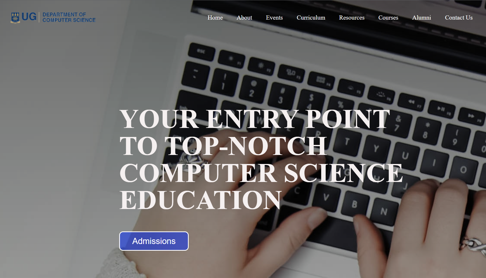
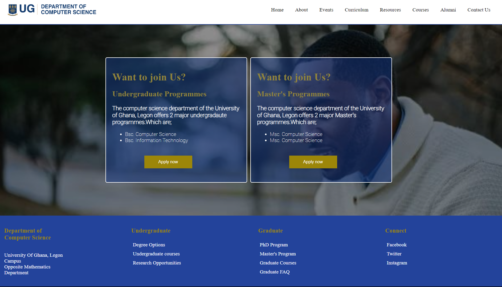
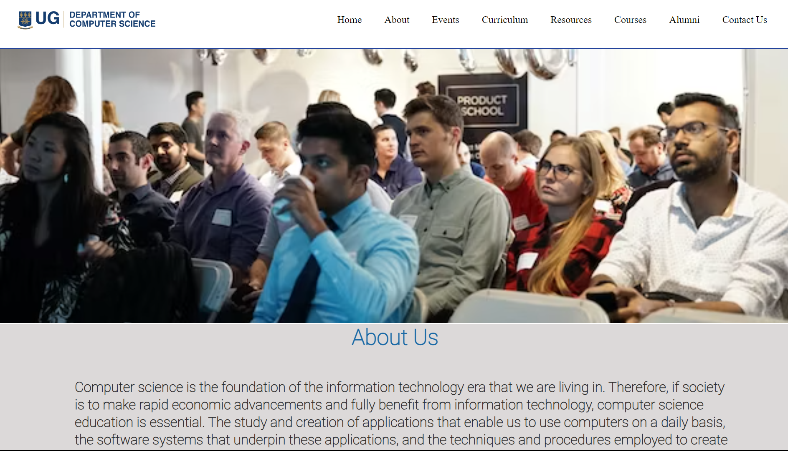
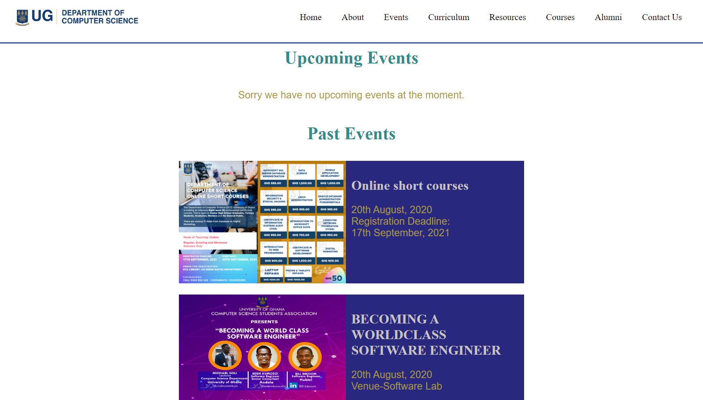
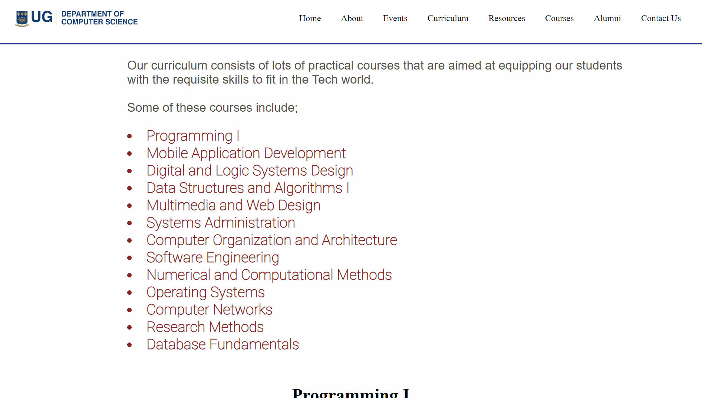
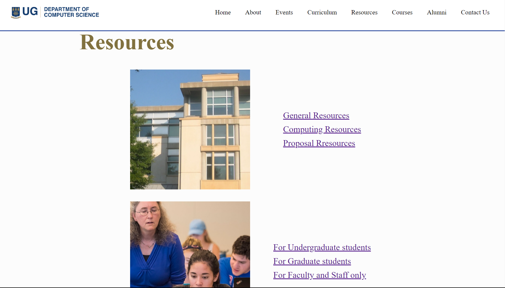
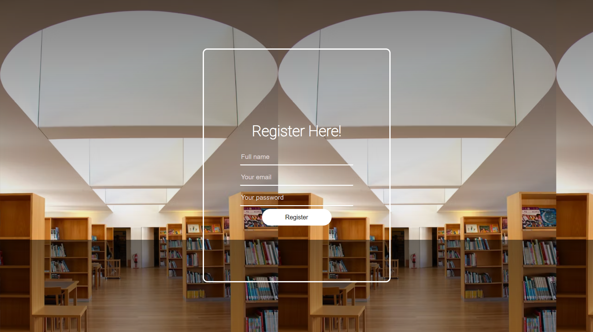
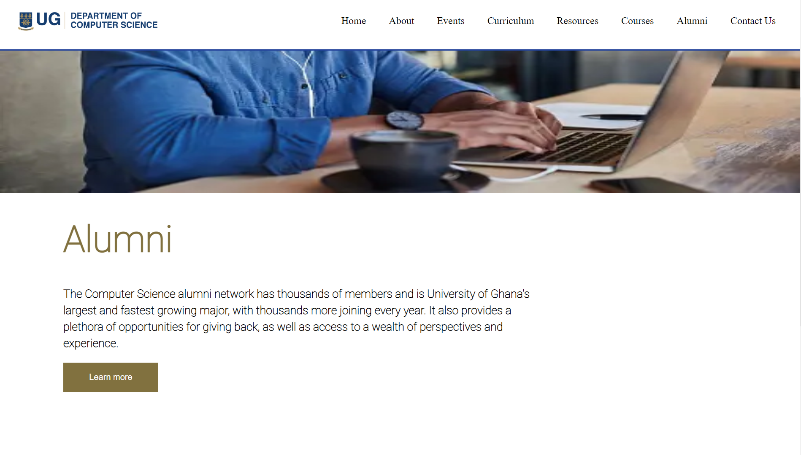
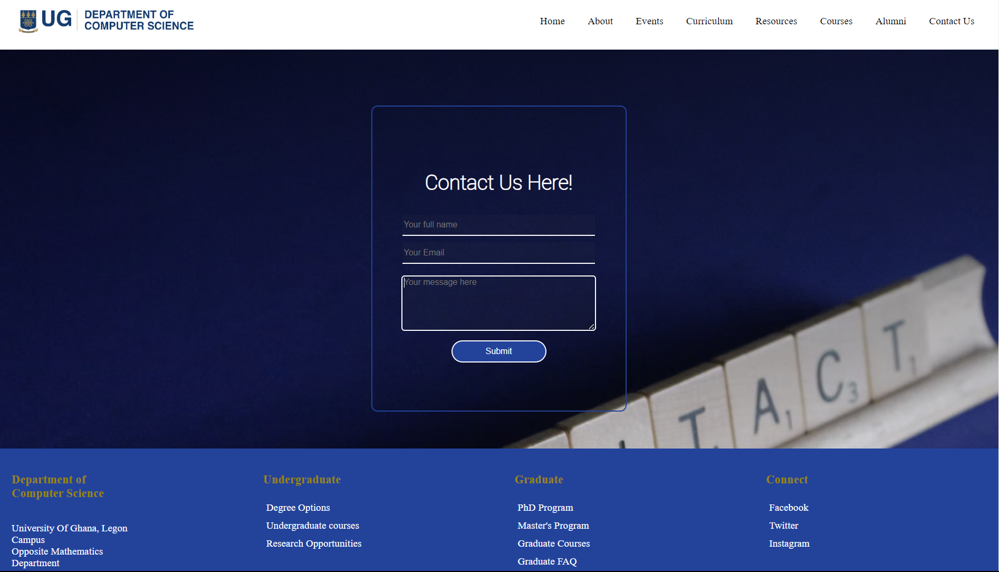

# DCIT_205_IA

//Project Description.

This project is a 10 page website for the computer science department of the University of Ghana, Legon.

This Project is meant to test the frontend web development skills of students offerring the DCIT 205 course that is Web Design and Multimedia. Also, it is meant to inform students about the computer science department, its events,people as well some wonderful courses and programmes available to students.

//How to clone and setup this project.

To clone and setup this project:

Step 1: Open your terminal or command prompt on your local machine.

Step 2: Navigate to where you want to save the cloned repository by typing 'cd' followed by the path.
For example if you want to save it in Desktop type : cd Desktop/

Step 3: Type git clone https://github.com/Phandoh/DCIT_205_IA.git

Step 4: After cloning, navigate into the folder named "DCIT_205_IA" using the same method as step 2.

Step 5: You can then proceed with working on the project.

//Student Details.

Student Name: Phandoh Kwabena Eyiah

Student ID: 11348753

//Below are screenshots of the pages of the website.

Home Page:

Admissions page:

About page:

Events page:

Curriculum page:

Resources page:

Courses page:

Register page:

Alumni page:

Contact Us page:

With this project I have learnt a lot of concepts in both HTML and CSS.
For HTML, I learnt how to structure my page into parts using divs as well as semantic HTML.
I also learnt new tags such as span, ul, li etc.

For CSS, I learnt how to use the box sizing model to style divs, how to insert background images and colors with linear gradients, how to use CSS specificity for styling, CSS positioning etc.

Finally, I believe i have also learnt how to familiarize myslef with newer technologies faster and independently.
